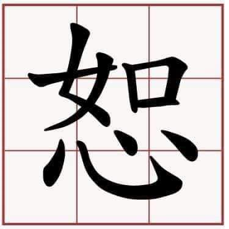

CHỮ THỨ
————

Chữ “Như” (如) và chữ “Tâm” (心) hợp lại thành chữ “Thứ” (恕), nghĩa là tha thứ, bao dung. Chữ “Như” ghép với chữ “Tâm” mang ý nghĩa là để cho trái tim gần với trái tim, để tâm mình gần với tâm người, tâm người cũng như tâm mình.

Trong Luận Ngữ, Khổng Tử đã hai lần nhắc đến chữ Thứ.
Một lần là Khổng Tử nói với Tăng Sâm: “Này Sâm, đạo của ta chỉ có một lẽ mà thông suốt hết tất cả”. Tăng Sâm thưa “Vâng”. Khi Khổng Tử ra rồi, các môn sinh khác hỏi Tăng Sâm: “Thầy muốn nói gì vậy?”. Tăng Sâm đáp: “Đạo của thầy chỉ có một lẽ Trung Thứ mà thôi”.

Một lần khác là khi Tử Cống hỏi: “Thưa thầy, có một chữ nào có thể dẫn dắt hành xử trọn đời không?”. Khổng Tử đáp: “Có lẽ là chữ Thứ chăng? Cái gì mà mình không muốn thì đừng làm cho người khác”.

Người có lòng nhân, luôn khoan dung, tha thứ cho kẻ khác thì sẽ chẳng bao giờ làm những điều ích kỷ lợi thân mà tổn hại cho người. Con người sống trên cõi đời chật chội, những chuyện va vấp là điều thường tình, ai chẳng có lúc phạm lỗi, mắc sai lầm? Cho nên trong quan hệ giữa người với người, cần suy xét thận trọng, để lòng mình gần gũi với lòng người, đặt mình vào địa vị đối phương mà suy nghĩ thì tự nhiên sẽ khoan thứ.

